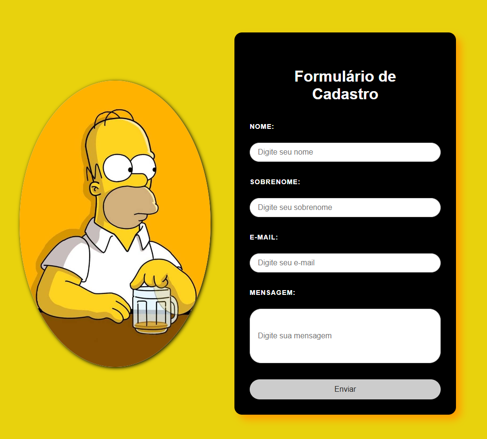

# 📝 Formulário de Cadastro

Sistema simples de **formulário** em PHP com conexão ao banco de dados MySQL.

---

## 🖥️ Demonstração



---

## 📂 Estrutura de pastas e arquivos

```
index.php                     # Página principal com o formulário de cadastro
cadastro.php                  # Processa o cadastro e salva no banco de dados
includes/conexao.php          # Conexão PDO com MySQL (oculto pelo .gitignore)
includes/mensagem.php         # Exibe mensagens de sucesso/erro no formulário
assets/css/style.css          # Estilos CSS do formulário e feedback visual
assets/img/homer simpson.jpg  # Imagem exibida ao lado do formulário
README.md                     # Documentação do projeto
.gitignore                    # Arquivos e pastas ignorados pelo Git
```

---

## 🚀 Como rodar

1. Configure o banco de dados MySQL e ajuste os dados de acesso em `includes/conexao.php`.
2. Inicie o servidor local (XAMPP, WAMP, etc).
3. Acesse `index.php` pelo navegador para utilizar o formulário.

---

## 🛠 Tecnologias utilizadas

- PHP 8+
- MySQL
- HTML5 & CSS3

---

## 👨🏻‍💻 Autor

**Davi Vieira**
